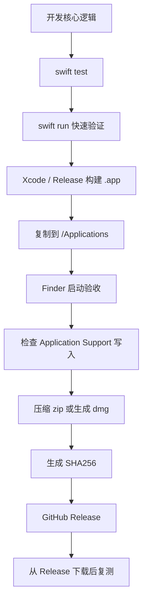

# macOS 开源 App 分发检查清单

【术语】App Bundle / Bundle Identifier / Application Support / Gatekeeper / Quarantine / LaunchAgent / Login Item

## 0. 适用前提

- 目标：小型 macOS 开源 App，例如 menubar 监控软件、轻量工具、状态栏插件。
- 分发方式：GitHub Release / Homebrew Cask / zip / dmg。
- 不走：Mac App Store、Apple Developer ID 签名、Notarization。
- 验收标准：本地安装态可运行、路径可控、配置隔离、可卸载、用户能按说明启动。

---

## 1. 开发态检查

| 检查项 | 标准 | 状态 |
|---|---|---|
| 核心逻辑可通过 `swift test` 验证 | 指标采集、配置解析、状态计算有测试覆盖 | ☐ |
| `swift run` 只用于开发期验证 | 不把 `swift run` 结果视为最终验收 | ☐ |
| UI 行为通过 `.app` 或 Xcode Run 验证 | menubar、popover、菜单、退出逻辑正常 | ☐ |
| Debug 与 Release 数据隔离 | 不共用正式配置目录 | ☐ |
| 没有依赖当前工作目录 | 不使用 `./config.json`、`currentDirectoryPath` 作为业务路径 | ☐ |
| 外部命令调用有失败处理 | `Process` 调用、权限不足、命令不存在均有 fallback | ☐ |
| 网络请求有超时 | 不因接口卡死拖住菜单栏主线程 | ☐ |
| 长任务不阻塞主线程 | 采集、IO、网络全部异步或后台执行 | ☐ |

---

## 2. Bundle 与应用身份检查

| 检查项 | 标准 | 状态 |
|---|---|---|
| Bundle Identifier 稳定 | 例如 `com.yourname.MyMonitor` | ☐ |
| Debug Bundle ID 单独区分 | 例如 `com.yourname.MyMonitor.dev` | ☐ |
| App 名称稳定 | `CFBundleName`、`CFBundleDisplayName` 一致 | ☐ |
| 版本号正确 | `CFBundleShortVersionString` = 用户可见版本 | ☐ |
| Build 号递增 | `CFBundleVersion` 每次 release 递增 | ☐ |
| 图标存在 | `.icns` 正常显示在 Finder / Dock / Activity Monitor | ☐ |
| Info.plist 权限文案完整 | 涉及文件、网络、通知、辅助功能时有说明 | ☐ |
| App 能从 Finder 双击启动 | 不依赖终端环境变量 | ☐ |

---

## 3. 运行目录与数据写入检查

结论：正式 App 默认只写入 `~/Library/Application Support/<bundle-id>/`，不要默认写 `~/.xxx`。

| 数据类型 | 推荐位置 | 状态 |
|---|---|---|
| 主配置 | `~/Library/Application Support/<bundle-id>/config.json` | ☐ |
| 应用状态 | `~/Library/Application Support/<bundle-id>/state.json` | ☐ |
| 日志 | `~/Library/Application Support/<bundle-id>/logs/app.log` 或 `~/Library/Logs/<bundle-id>/` | ☐ |
| 缓存 | `~/Library/Caches/<bundle-id>/` | ☐ |
| 临时文件 | `FileManager.default.temporaryDirectory` | ☐ |
| 用户导入文件 | 用户显式选择的位置 | ☐ |

### 必查项

| 检查项 | 标准 | 状态 |
|---|---|---|
| 首次启动自动创建目录 | 不需要用户手动 mkdir | ☐ |
| 目录创建失败有错误提示 | 权限、磁盘、路径异常可见 | ☐ |
| 配置 schema 有版本号 | 方便后续迁移 | ☐ |
| 配置损坏可恢复 | 备份旧文件，生成默认配置 | ☐ |
| Debug 不污染 Release 配置 | 两套目录独立 | ☐ |
| Release 不读取开发目录 | 不读取项目根目录、`.build`、测试样例 | ☐ |
| 环境变量只作为开发覆盖项 | 正式用户不依赖 env | ☐ |

---

## 4. `swift run` 与安装版冲突检查

| 冲突点 | 检查标准 | 状态 |
|---|---|---|
| 配置目录 | Debug / Release 不共用同一目录 | ☐ |
| UserDefaults | suite name 或 Bundle ID 不混用 | ☐ |
| 端口监听 | 同端口启动时有明确错误提示 | ☐ |
| 临时文件 | 文件名包含 Bundle ID 或进程唯一标识 | ☐ |
| 日志文件 | Debug 与 Release 分开 | ☐ |
| 后台任务 | 不出现两个实例同时写同一状态文件 | ☐ |
| Lock 文件 | 需要单实例时有锁机制 | ☐ |
| 菜单栏重复实例 | 重复启动时行为可控 | ☐ |

### 单实例建议

- 小工具允许多实例：必须保证数据写入不冲突。
- 小工具不允许多实例：启动时检查已有实例，必要时激活旧实例并退出新实例。

---

## 5. 菜单栏 App 专项检查

| 检查项 | 标准 | 状态 |
|---|---|---|
| 无 Dock 图标时行为正确 | `LSUIElement` 配置符合预期 | ☐ |
| 菜单栏图标清晰 | 浅色 / 深色模式都可见 | ☐ |
| 点击菜单栏响应稳定 | 左键、右键、重复点击无异常 | ☐ |
| Popover 失焦关闭策略正确 | 不误关、不残留 | ☐ |
| 退出入口明确 | 菜单中有 Quit | ☐ |
| 崩溃后不残留后台进程 | Activity Monitor 中无孤儿进程 | ☐ |
| 周期采集可暂停 | 睡眠、唤醒、网络变化后能恢复 | ☐ |
| 高 CPU / 高内存有保护 | 采集频率、缓存、timer 不失控 | ☐ |

---

## 6. 权限与系统能力检查

| 能力 | 检查标准 | 状态 |
|---|---|---|
| 通知 | 首次请求时机合理，拒绝后不反复弹窗 | ☐ |
| 文件访问 | 只在需要时请求，失败有说明 | ☐ |
| 辅助功能 | 如需 Accessibility，提供打开系统设置指引 | ☐ |
| 网络访问 | 离线、DNS 失败、代理环境均可处理 | ☐ |
| 登录启动 | 开关状态准确，卸载前可关闭 | ☐ |
| 开机自启失败 | 用户能看到错误或修复说明 | ☐ |

---

## 7. 打包检查

| 检查项 | 标准 | 状态 |
|---|---|---|
| Release 构建 | 使用 Release configuration | ☐ |
| `.app` 可独立运行 | 不依赖源码目录、`.build`、Xcode | ☐ |
| 资源文件进入 bundle | 图片、默认配置、模板文件均存在 | ☐ |
| 动态库依赖完整 | 没有缺失 dylib / framework | ☐ |
| 压缩包结构清晰 | zip 解压后直接看到 `.app` | ☐ |
| dmg 结构清晰 | `.app` + Applications alias + README 可选 | ☐ |
| 文件名包含版本 | `MyMonitor-1.2.0-macOS.zip` | ☐ |
| 构建产物可复现 | 有脚本或 GitHub Actions | ☐ |

### 推荐产物

| 场景 | 推荐格式 |
|---|---|
| 最简单 GitHub Release | `.zip` |
| 面向普通用户 | `.dmg` |
| 面向开发者 | Homebrew Cask |
| 同时兼顾 | `.dmg` + `.zip` + Homebrew Cask |

---

## 8. 无 Apple 签名分发专项检查

结论：不签名可以分发，但用户首次启动体验会更差。README 必须写清楚打开方式。

| 检查项 | 标准 | 状态 |
|---|---|---|
| README 说明 Gatekeeper 提示 | 明确告知可能出现“无法验证开发者” | ☐ |
| 提供右键打开方式 | `Right click → Open` | ☐ |
| 提供命令行去 quarantine 方式 | `xattr -dr com.apple.quarantine /Applications/AppName.app` | ☐ |
| 明确风险说明 | 让用户知道这是未签名开源构建 | ☐ |
| 提供源码构建方式 | 用户可自行 clone 并 build | ☐ |
| 提供 checksum | Release 中附 SHA256 | ☐ |
| Release tag 对应源码 | 产物来自对应 tag | ☐ |
| 不伪装成已签名软件 | 文档中不要暗示系统信任 | ☐ |

### README 中建议放置

```bash
# 如 macOS 阻止打开，可执行：
xattr -dr com.apple.quarantine /Applications/MyMonitor.app
```

或说明：

```text
Right click MyMonitor.app → Open → Open
```

---

## 9. 本地安装态验收

| 场景 | 验收标准 | 状态 |
|---|---|---|
| 从 Finder 启动 | 正常启动，不依赖终端 | ☐ |
| 放入 `/Applications` 启动 | 正常读写用户目录 | ☐ |
| 放在 Downloads 启动 | 不错误写入 Downloads | ☐ |
| 删除后重新安装 | 配置保留或按预期初始化 | ☐ |
| 首次启动 | 自动创建配置目录 | ☐ |
| 第二次启动 | 正常读取已有配置 | ☐ |
| 同时启动 Debug 和 Release | 无配置污染 | ☐ |
| 重启系统后 | 登录项、状态恢复符合预期 | ☐ |
| 睡眠唤醒后 | 监控采集恢复 | ☐ |
| 断网后恢复 | 网络相关状态恢复 | ☐ |
| macOS 深色模式 | 图标和 UI 可读 | ☐ |
| 卸载后 | 无残留后台进程 | ☐ |

---

## 10. 升级与兼容检查

| 检查项 | 标准 | 状态 |
|---|---|---|
| 旧配置可迁移 | 新版本能读取上个版本配置 | ☐ |
| 配置迁移可回滚 | 迁移前备份旧配置 | ☐ |
| 新版本覆盖安装正常 | 替换 `.app` 后数据保留 | ☐ |
| 降级行为明确 | 不支持降级时文档说明 | ☐ |
| 版本不兼容时有提示 | 不静默破坏配置 | ☐ |
| Release note 写 breaking changes | 用户能判断是否升级 | ☐ |

---

## 11. 卸载检查

README 必须包含卸载说明。

| 检查项 | 标准 | 状态 |
|---|---|---|
| 删除 App 本体 | 删除 `/Applications/MyMonitor.app` | ☐ |
| 删除配置 | 删除 `~/Library/Application Support/<bundle-id>/` | ☐ |
| 删除缓存 | 删除 `~/Library/Caches/<bundle-id>/` | ☐ |
| 删除日志 | 删除 `~/Library/Logs/<bundle-id>/`，如使用 | ☐ |
| 关闭登录项 | App 内提供关闭入口或说明 | ☐ |
| 清理 LaunchAgent | 如使用 LaunchAgent，说明 plist 路径 | ☐ |

---

## 12. GitHub Release 检查

| 检查项 | 标准 | 状态 |
|---|---|---|
| tag 已创建 | `v1.2.0` | ☐ |
| Release title 清晰 | `MyMonitor v1.2.0` | ☐ |
| Release note 有变更摘要 | Added / Changed / Fixed | ☐ |
| 上传 `.zip` 或 `.dmg` | 文件名带版本号 | ☐ |
| 上传 SHA256 | `checksums.txt` | ☐ |
| README 安装方式更新 | 与当前产物一致 | ☐ |
| 截图更新 | UI 有变化时更新 | ☐ |
| 已标注未签名 | 不让用户误以为无 Gatekeeper 提示 | ☐ |
| 已测试下载产物 | 从 GitHub Release 下载后本机验证 | ☐ |

---

## 13. README 最小内容

| 模块 | 必须包含 | 状态 |
|---|---|---|
| 项目简介 | 一句话说明用途 | ☐ |
| 截图 | 至少 1 张 menubar / popover 截图 | ☐ |
| 安装 | zip / dmg / Homebrew Cask | ☐ |
| 首次打开 | 未签名 App 的打开方式 | ☐ |
| 配置位置 | `Application Support/<bundle-id>` | ☐ |
| 权限说明 | 为什么需要相关权限 | ☐ |
| 卸载 | App、配置、缓存、日志清理路径 | ☐ |
| 从源码构建 | `git clone`、`swift build` 或 Xcode 打开方式 | ☐ |
| 开发命令 | `swift test`、`swift run`、打包脚本 | ☐ |
| License | MIT / Apache-2.0 / GPL 等 | ☐ |

---

## 14. CI / 自动化检查

| 检查项 | 标准 | 状态 |
|---|---|---|
| PR 运行测试 | `swift test` | ☐ |
| Release 运行构建 | Release configuration build | ☐ |
| 自动生成 zip | 构建后压缩 `.app` | ☐ |
| 自动生成 checksum | SHA256 写入 `checksums.txt` | ☐ |
| 产物不包含开发文件 | 不包含 `.git`、`.build`、测试数据 | ☐ |
| 版本号来源单一 | tag / plist / Package.swift 不互相打架 | ☐ |

---

## 15. 最小验收命令

### 检查产物结构

```bash
ls -la dist/
ls -la "dist/MyMonitor.app/Contents"
```

### 检查 Bundle ID

```bash
/usr/libexec/PlistBuddy -c "Print :CFBundleIdentifier" "dist/MyMonitor.app/Contents/Info.plist"
```

### 检查版本号

```bash
/usr/libexec/PlistBuddy -c "Print :CFBundleShortVersionString" "dist/MyMonitor.app/Contents/Info.plist"
/usr/libexec/PlistBuddy -c "Print :CFBundleVersion" "dist/MyMonitor.app/Contents/Info.plist"
```

### 从命令行启动 App

```bash
open "dist/MyMonitor.app"
```

### 查看运行进程

```bash
ps aux | grep MyMonitor | grep -v grep
```

### 查看写入目录

```bash
ls -la "$HOME/Library/Application Support/com.yourname.MyMonitor"
```

### 移除 quarantine

```bash
xattr -dr com.apple.quarantine "/Applications/MyMonitor.app"
```

### 生成 checksum

```bash
shasum -a 256 "MyMonitor-1.2.0-macOS.zip" > checksums.txt
```

---

## 16. Release 前最后检查

| 检查项 | 状态 |
|---|---|
| `swift test` 全部通过 | ☐ |
| Release `.app` 能从 Finder 启动 | ☐ |
| `.app` 不依赖源码目录 | ☐ |
| 首次启动创建正确目录 | ☐ |
| Debug / Release 配置不冲突 | ☐ |
| 菜单栏、退出、重启后行为正常 | ☐ |
| README 已说明未签名打开方式 | ☐ |
| README 已说明配置与卸载路径 | ☐ |
| Release note 已写 | ☐ |
| zip / dmg 已上传 | ☐ |
| checksum 已上传 | ☐ |
| 从 GitHub 下载产物后复测通过 | ☐ |

---

## 17. 推荐的实际流程



---

## 18. 你的项目默认策略

| 决策项 | 建议 |
|---|---|
| 是否继续用 `swift run` | 用，但只做开发期验证 |
| 是否必须打包验收 | 必须 |
| 是否使用 `~/.xxx` | 不建议默认使用 |
| 正式配置目录 | `~/Library/Application Support/<bundle-id>/` |
| Debug 配置目录 | `~/Library/Application Support/<bundle-id>.dev/` |
| 分发格式 | GitHub Release `.zip` 起步，后续补 `.dmg` |
| 是否 Apple 签名 | 不需要，但 README 必须说明 Gatekeeper 打开方式 |
| 是否 Homebrew Cask | 有稳定版本后再加 |
| 是否自动更新 | 初期不需要，成熟后再评估 Sparkle |

